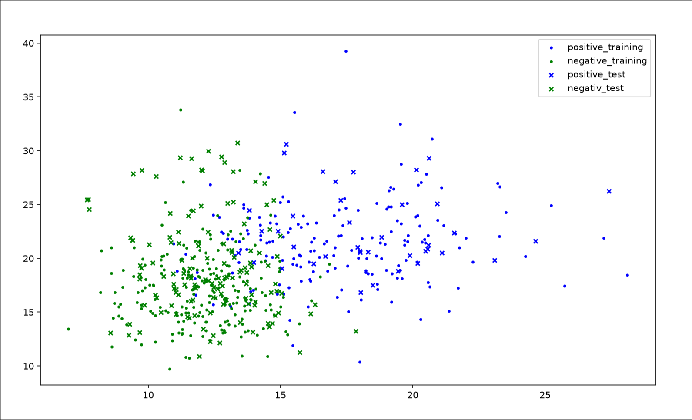

# K Nearest Neighbors

cancer diagnosis:

- Decides whether the cancer is real or not by looking at the K nearest neighbors

- calculates K by comparing the euclidean distances of all neighbors

# Linear Regression

AutoMPG:

- Predicts Miles per Gallon based on the weight of the car 

- Gradient Descent - uses Linear Regression with Gradient Descent to compute the best fitting linear function

- OLS - uses Ordinary Least Squares to compute the best fitting linear function

# Logistic Regression

Banknote Authentication:

- Decides whether a banknote is real or fake using computed weights for different parameters
- computes the weights using the binary cross entropy loss function with gradient descent

